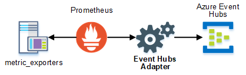

# prometheus-eventhubs-adapter
[](https://dev.azure.com/bryanklewis/prometheus-eventhubs-adapter/_build/latest?definitionId=5&branchName=master) [](https://godoc.org/github.com/bryanklewis/prometheus-eventhubs-adapter)

[Prometheus](https://prometheus.io/docs/operating/integrations/) remote storage adapter for [Azure Event Hubs](https://docs.microsoft.com/en-us/azure/event-hubs/event-hubs-about).

## Architecture



Additional information on using Azure Data Explorer (Kusto) with events written by this adapter is in [docs/adx.md](./docs/adx.md)

## Configuration

Adapter configuration can be set using any of the available methods. Configuration is returned using the following precedence order. Each item takes precedence over the item below it:

* [Commandline Flags](#commandline-flags)
* [Environment Variables](#environment-variables)
* [TOML File](#toml-file)
* *Default*

### Commandline Flags

#### Adapter

| Flag                     | Description                                      |
| ------------------------ | ------------------------------------------------ |
| `--read_timeout`         | the HTTP request timeout to use for incomming connections. A duration string of decimal numbers and a unit suffix. See [time#ParseDuration](https://golang.org/pkg/time/#ParseDuration) package. *Default 5s* |
| `--write_timeout`        | the HTTP request timeout to use when sending samples to the remote storage. A duration string of decimal numbers and a unit suffix. See [time#ParseDuration](https://golang.org/pkg/time/#ParseDuration) package. *Default 10s* |
| `--listen_address`       | the address to listen on for web endpoints. *Default :9201* |
| `--write_path`           | the path for write requests. *Default /write* |
| `--telemetry_path`       | the path for telemetry scraps. *Default /metrics* |
| `--log_level`            | the log level to use, from least to most verbose: none, error, warn, info, debug. Using debug will enable an HTTP access log for all incomming connections. *Default info* |
| `--write_batch`          | send samples in batches (true) or as single events (false). *Default true* |
| `--write_serializer`     | serializer to use when sending events. See [json](#json), [avro-json](#avro-json) |
| `--write_adxmapping`     | the name of the Azure Data Explorer (ADX or Kusto) mapping used for Schema column mapping of events during [data injestion](./docs/adx.md) to an ADX cluster. *Default promMap* |

#### Event Hub

| Flag                     | Description                                      |
| ------------------------ | ------------------------------------------------ |
| `--write_namespace`      | the namespace of the Event Hub instance. *Required unless using connection string*  |
| `--write_hub`            | the name of the Event Hub instance. *Required unless using connection string* |
| 1. SAS TokenProvider        |  |
| `--write_keyname`        | the name of the Event Hub key |
| `--write_keyvalue`       | the secret for the Event Hub key named in `write_keyname` |
| 2. SAS TokenProvider        |  |
| `--write_connstring`     | connection string from the Azure portal like: `Endpoint=sb://foo.servicebus.windows.net/;SharedAccessKeyName=MySendKey;SharedAccessKey=fluffypuppy;EntityPath=hubName` |
| 1. AAD TokenProvider        |  |
| `--write_tenantid`       | the Azure Tenant ID |
| `--write_clientid`       | the Azure Application ID |
| `--write_clientsecret`   | secret for the corresponding application |
| 2. AAD TokenProvider        |  |
| `--write_tenantid`       | the Azure Tenant ID |
| `--write_clientid`       | the Azure Application ID |
| `--write_certpath`       | the path to the certificate file |
| `--write_certpassword`   | the password for the certificate |

You must set `write_namespace`, `write_hub` and one of the token providers OR use `write_connstring`.

There are two sets of configuration flags which can produce a SAS TokenProvider.

1. Expected Environment Variables:
    - `--write_keyname`
    - `--write_keyvalue`

2. Expected Environment Variable:
    - `--write_connstring`

There are two sets of configuration flags which can produce a AAD TokenProvider.

1. Client Credentials: attempt to authenticate with a [Service Principal](https://docs.microsoft.com/en-us/azure/azure-resource-manager/resource-group-create-service-principal-portal) via
    - `--write_tenantid`
    - `--write_clientid`
    - `--write_clientsecret`

2. Client Certificate: attempt to authenticate with a Service Principal via 
    - `--write_tenantid`
    - `--write_clientid`
    - `--write_certpath`
    - `--write_certpassword`

**Sample**
```bash
## Linux
./prometheus-eventhubs-adapter --read_timeout=5s --log_level=info --write_batch
```

### Environment Variables

Environment variables can be used by adding the prefix `ADAP_` to any configuration option in all `UPPERCASE`.

**Sample**
```bash
## Linux
export ADAP_LOG_LEVEL=info
echo $ADAP_LOG_LEVEL
```
```dos
## Windows 
set ADAP_WRITE_BATCH=true
echo %ADAP_WRITE_BATCH%
```

### TOML File

The adapter will search for a TOML formatted file with the name `prometheus-eventhubs-adapter.toml` in the directories listed below in ordered.

1. Directory where executable is located
2. On unix-like systems: */etc/prometheus-eventhubs-adapter/prometheus.yml*
3. Current working directory
4. OS-specific home directory

Example TOML file: [`prometheus-eventhubs-adapter.toml`](./prometheus-eventhubs-adapter.toml)

## Prometheus

You must tell prometheus to use this remote storage adapter by adding the following lines to `prometheus.yml`:
```yaml
remote_write:
  - url: "http://<adapter-address>:9201/write"
```

## Output

Azure Event Hubs connections are created using AMQP with the [Golang Event Hubs Client](https://github.com/Azure/azure-event-hubs-go). Timestamps are formatted in RFC3339 UTC. Metric samples with a float64 value of `NaN` (not-a-number) are set to `0` before serialization.

Adapter will serialize the events depending on the `write_serializer` value.

### JSON

Encodes events as JSON using the Golang standard library.

**Model**
```json
{
  "timestamp": "1970-01-01T00:00:00Z",
  "value": "373.71",
  "name": "process_cpu_seconds_total",
  "labels": {
    "label1": "value1",
    "label2": "value2"
  }
}
```

`timestamp` and `value` are reserved values, and can't be used as label names. `__name__` is moved as `name` to the top level and dropped from the label set.

### Avro-JSON

Encodes events as JSON using the goavro library. The Avro-JSON data model is the same as JSON, but serializes using an Avro Codec. The Avro [schema](./serializers/avrojson/avrojson.go) is embedded in the adapter.

**Schema**
```json
{
  "namespace": "io.prometheus",
  "type": "record",
  "name": "Metric",
  "doc:" : "A basic schema for representing Prometheus metrics",
  "fields": [
    {"name": "timestamp", "type": "string"},
    {"name": "value", "type": "double"},
    {"name": "name", "type": "string"},
    {"name": "labels", "type": { "type": "map", "values": "string"} }
  ]
}
```

## Building

Requirements:

* [Go](https://golang.org/dl/) 1.12.x or higher
* Go [modules](https://github.com/golang/go/wiki/Modules) is used for dependency management

```bash
## Build binary
go build
```

## License

Copyright 2019 Micron Technology, Inc. All rights reserved. Licensed under the [Apache 2.0](./LICENSE) license.

### Third Party Dependencies

Third party code and dependencies are copyright of their respective owners. See [NOTICE](./NOTICE) for additional information.
