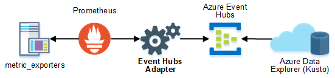
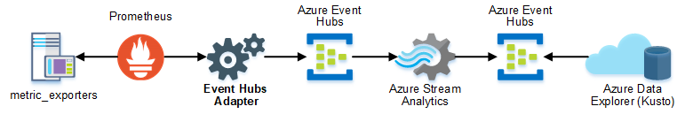

# Azure Data Explorer

Consuming events from an Event Hub into Azure Data Explorer.

### Azure Links

* Ingest overview: https://docs.microsoft.com/en-us/azure/data-explorer/ingest-data-overview
* How-to guides: https://docs.microsoft.com/en-us/azure/data-explorer/ingest-data-event-hub

## Single Event
---
Single events can be tagged with user properties for [Azure Data Explorer](https://docs.microsoft.com/en-us/azure/data-explorer/ingest-data-event-hub) (ADX) dynamic routing. Dynamic routing enables events read from a single Event Hub to land in different tables in your Kusto cluster.

This requires the following properties to be added to the event.Properties bag:

* **Table** - name (case sensitive) of the target Data Explorer table
  * Sample or metric name, ex. "process_cpu_seconds_total".

* **Format** - payload format using a [supported data format](https://docs.microsoft.com/en-us/azure/kusto/management/data-ingestion/#supported-data-formats).
  * Value set by serializer.ADXFormat() for the configured serializer.

* **IngestionMappingReference** - name of the ingestion mapping object [precreated on the database](https://docs.microsoft.com/en-us/azure/kusto/management/tables?branch=master#create-ingestion-mapping) to use for schema mapping.
  * Set to value of config `write_adxmapping`.

**Sample**
```golang
event := eventhub.NewEvent(sample.Payload)
event.Properties = map[string]interface{}{
	"Table": sample.Name,
	"Format": "json",
	"IngestionMappingReference": "promMap",
}
```

### Architecture



## Batch Events
---
Batch events share a common event.Properties bag. Assigning individual values for ADX dynamic routing is not possible. Instead, bulk written events can be processed to a second Event Hub using Azure Stream Analytics. The processed events can then be consumed by the ADX cluster.

### Architecture

